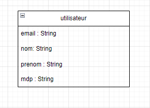

# Cache-Redis-pour-EtuServices

### Objectifs et Motivation

L'objectif de ce TP est d'introduire les bases de la gestion de bases de données redis avec python.
Pour se faire, j'ai implémenté un début d'application avec une connexion, une page d'accueil avec deux actions "acheter" et "vendre".

Le point important du tp est la gestion des sessions des utilisateurs. 
Si un utilisateur se connecte, achète ou vends plus de 10fois en 10min, la connexion doit être refusée. 
C'est pour ce point que l'on utilise une base de donnée Redis, qui est dite "chaude", c'est-à-dire qu'elle permet un grand nombre de requêtes et de modification de ses tables.

A noter que ce projet a été fait en 4h, la partie qui reliait le HTML/CSS aux requêtes Redis n'a pas été réussie, il faudra exécuter les fichiers séparément afin de tester les fonctions.

### Partie SQL/HTTP

Pour la page de connexion et les pages de services, j'ai utilisé un code simple avec du PHP et HTML.
Il vous faut une bdd simple de la forme suivante :

Il suffit ensuite de faire une requête sql pour vérifier si l'identifiant et le mdp sont corrects, pour accepter la connexion.

Lorsque l'on accepte la connexion, il faut ensuite appeler la fonction python qui vérifie le nombre de connexions de l'utilisateur.

On arrive sur une page d'accueil. 
On a deux actions possibles qui vont être des actions directes sur la base de donnée Redis.
"Acheter" et "Vendre"

Pour l'instant, on ne vérifie que l'utilisateur n'effectue pas la même action 10fois d'affilées en 10min.

### Partie Python et Redis

Suite à des problèmes de liens entre le PHP et le python qui ne se faisaient pas, je n'ai pas trop eu le temps de développer cette partie.
J'ai écrit les fonctions en python qui stockent les requêtes dans la base de donnée Redis.

Lors de la première requête, on crée le champ qui correspond à l'action effectuée. 
On utilise la fonction expire de Redis pour supprimer le champ au bout de 10min, ce qui correspond au fait que l'utilisateur a à nouveau le droit de se connecter.

### Lancer le projet

1) Créer la base de donnée avec le fichier SQL fourni
2) Rentrer ses informations de connexion à la base de données dans les fichiers en .php
3) Lancer une base de données Redis
4) Exécuter les fonctions qu'il vous plaît dans connectionRedis.py ou lancez le fichier login.php
